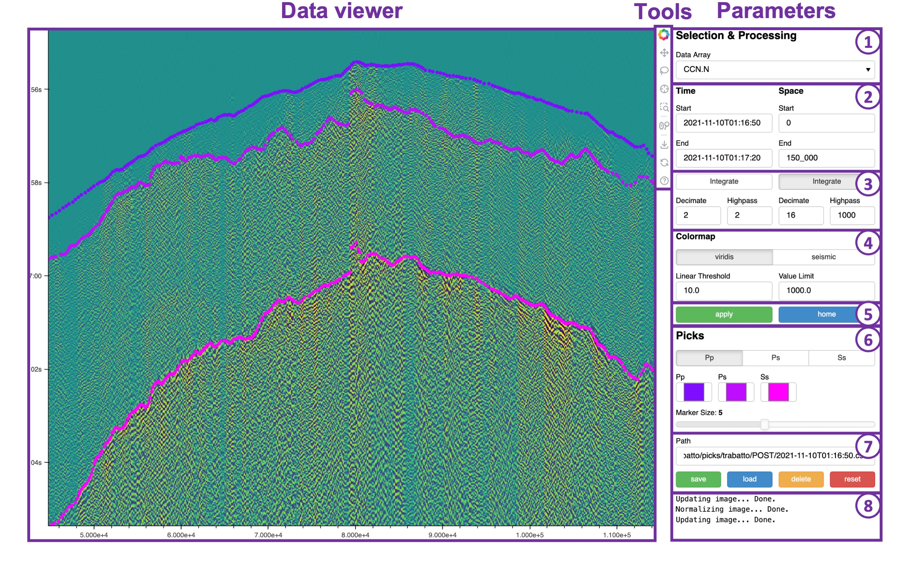

# Xpick

[](https://zenodo.org/doi/10.5281/zenodo.10678341)

*Xpick* is the ultimate web app for manual picking of DAS data. It allows to freely draw arrivals on 2D data, making possible the manual picking of thousands of DAS traces. It can be run on remote machine and used within your local browser. It uses Bokeh as backend.




## Instalation

Bokeh apps require nodejs that can be installed with conda:

```
conda install nodejs
```

Then xpick can be installed from github:

```
pip install "git+https://github.com/xdas-dev/xpick.git"
```

## How to launch Xpick

To call Xpick you first need to use Xdas to save one or several data array or one data collection in the native Xdas format. 

For now the data arrays must be 2D and have a `time` and `distance` dimension. 

From you raw DAS data you can either do:

```python
import xdas
da = xdas.open_mfdataarray("path_with_*_to_your_files.nc", engine="file_format")
da.to_netcdf("data_array_path.nc")
```

Or if you have a more complex dataset:

```python
import xdas
dc = xdas.open_mfdatatree(
    "path_to_the_root_directory/{field1}/{field2}/[acquisition].nc", 
    engine="file_format",
)
dc.to_netcdf("data_collection_path.nc")
```

Please refer to the Xdas documentation for more details on how to consolidate DAS datasets.

Once the consolidated datasets have been generated, you can open those master files with Xpick:

```
xpick <paths_of_several_data_arrays_or_path_of_one_data_collection>
```

The paths to your data arrays must be provided at execution time. You can use wildcards.

If you work on a remote machine, you need do port forwarding. VSCode automatically does it for you. You can check in the PORT tab of the bottom panel that every thing is configure correctly. The same port number should be used on the remote and local machine. If the default port (5006) is already in use you can specify another port with the `--port` option.

For more options look at the help

```
xpick -h
```

Xpick allows for size of the app configuration, and for the selection of the labels and the colors of the phases to pick. Bellow one example:

```
xpick data_collection_path.nc --phases=Pp,Ps,Ss --colors=#7F0DFF,#BF0DFF,#FF00FF --height=850
```

## How to use Xpick

The web app is composed of three main panels (see figure above). 

### Data viewer

This panel displays the waveforms and the annotated picks on top of it. The x-axis correspond to the `distance` dimension. The y-axis correspond to the `time` dimension (going down). Units corresponds to the one of the provided data (generally meters for the `distance` dimension and datetime strings for the `time` dimension). 

### Tools

This panel is used to select tools to interact with the *Data viewer* panel. It contains the following tools that can be activated/deactivated by clicking on it. Note that activating some tools can deactivate other tools that cannot be active at the same time. 

- **Pan**: If active, keeping the click down on the data viewer panel and panning effectively pans the waveforms.
- **Lasso Select**: Used to select some picks to remove. While the selection is performed the *delete* button can be clicked to remove selected picks (see Parameter - 7).
- **Picker Tool**:  If active, keeping the click down on the data viewer panel and panning will add picks. The used label and how picks are displayed can be chosen in Parameter - 6. Note that picking the same phase on an distance range that already contains picks will overwrite the preexisting picks. 
- **Box Zoom**: Is used to draw a rectangular box on the data to zoom into.
- **Wheel Zoom**: Is used to zoom in and out with the mouse's wheel. Note that placing the mouse on one of the x or y axis and "wheeling" will only zoom on the concerned axis.

Other tools can be ignored.

### Parameters

This panel is used to configure how the data is rendered and to save/load picks.

1. **Data Source Selection**: If a data collection was opened or if several data arrays were opened a drop down list of the available data arrays or data sequences will be present. It allows to select where to get data from.
2. **Time/Space Slicing**: used to specify the time and space interval of interest. Empty field means to keep everything. Every string that can be parse as a numpy.datetime64 for the `time` dimension and into a float for the `distance` dimension are accepted. Used units correspond to the one of the provided data.
3. **Processing**: data can be integrated in time (to get strain), in space (to get velocity) or both (to get displacement). This generally requires to apply some high pass filtering. Note that the high pass in time must be provided as frequency in Hz while high pass in space must be specified in the units of the distance dimension (e.g., meters). Data can also be decimated by any integer factor both in time and space. This is useful to reduce the size of the data to display. Leaving a field empty bypass the corresponding processing step.
4. **Color Map**: this is used to adapt the color map range and contrast. Two color maps are provided: viridis and seismic. To determine the color map range, the *Value Limit* can be chosen. To get a linear color map the *Linear Threshold* value must be chosen equal to the *Value Limit* value. To use a compressed color map to increase the visibility of small amplitude signals, the *Linear Threshold* can be reduced. In that case the color map will be linear up to that point and then become logarithmic meaning that amplitude above that threshold will have much similar colors even if the amplitude grows in a significative manner. Note that if those fields are left empty, the max value will be chosen as *Value Limit* and a tenth of it will be used as the *Linear Threshold*. 
5. **Apply/Home buttons**: The *apply* button must be pressed to make all the field parameters in 1 to 4 be taken into account. Only required stages will be recomputed. Yet those operation take a little bit of time and cannot be done automatically each time the user change a field. The *home* button is used to reset the extent of the data viewer panel to the original configuration set in Parameters - 2.
6. **Picks**: When using the *Picker Tool*, the phase that will be picked must be chosen in that panel. The displayed colors for each phase can be customized in each separated color pickers for each phase. The size of the picks markers can be chosen thanks to the slider bar.
7. **Save/Load/Delete/Reset**: Annotated picks can be saved to a .csv file by providing a path (that will be relative to where the `xpick` command have been launched) and clicking on the *save* button. To load a preexisting file, the *load* button can be used. The *delete* button is used to delete picks selected with the lasso tool. The *reset* button removes all annotated picks. 
8. **Console**: Xpick keeps you informed from what's is going on. If you click on a button and nothing happens, try to have a look at the terminal where `xpick` was executed and look for eventual errors.

## Recommendations

- **Xpick is not meant to load very long time period**. Selecting very long period can produces images that are to big to be displayed. The maximal duration that can usually be display is of the order of a few minutes (depending on the number of channels and the sampling rate). Otherwise important down sampling must be performed.
- **Do not forget to reset the picks when switching from one event to another**. Picks can be in memory without being visible, forgetting to reset when changing temporal area results into getting picks from several events added to the same file. 
